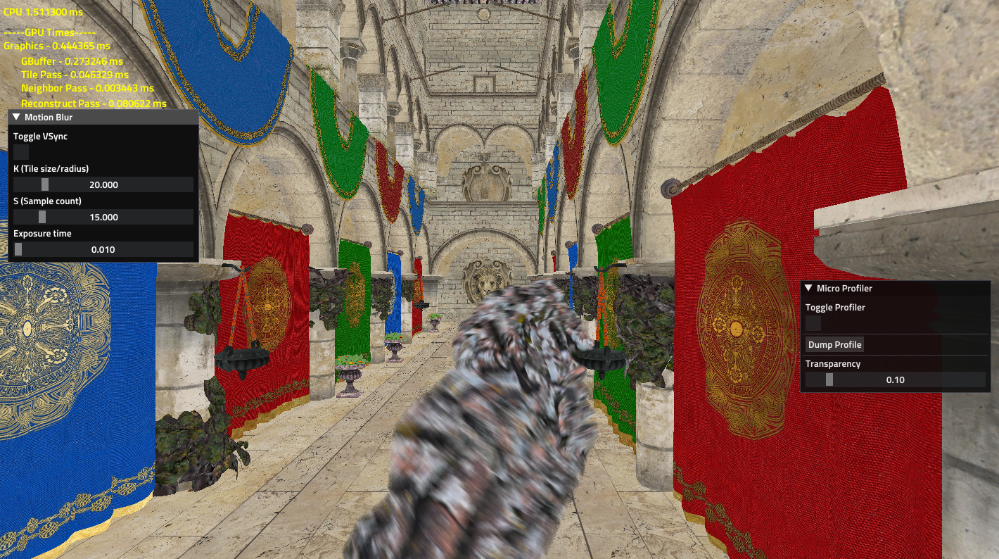

# An Implemention of "A Reconstruction Filter for Plausible Motion Blur" - [Web Page](https://aminaliari.github.io/posts/motionblur/)

  

[](https://aminaliari.github.io/posts/motionblur)

  

## How to build

1. Install the Vulkan SDK and

2. Run `PRE_BUILD.bat` to download Sponza's Art assets.

3. Open the project with Visual Studio 2017:

```

\Examples_3\Unit_Tests\PC Visual Studio 2017\Unit_Tests.sln

```
4. Select `DebugVK` or `ReleaseVK` as the build target.

  

## References

- McGuire, M., Hennessy, P., Bukowski, M., & Osman, B. (2012). [A Reconstruction Filter for Plausible Motion Blur](https://casual-effects.com/research/McGuire2012Blur/index.html). Proceedings of the ACM SIGGRAPH Symposium on Interactive 3D Graphics and Games 2012 (I3D’12).
- Sponza model authored by Frank Meinl at [Crytek](https://www.crytek.com).
- Sponza model acquired from [McGuire Computer Graphics Archive](https://casual-effects.com/data).
- [The Forge](https://github.com/ConfettiFX/The-Forge) - version 1.46
  

## License

The project's license is MIT. However, The Forge middleware uses Apache 2.0.
